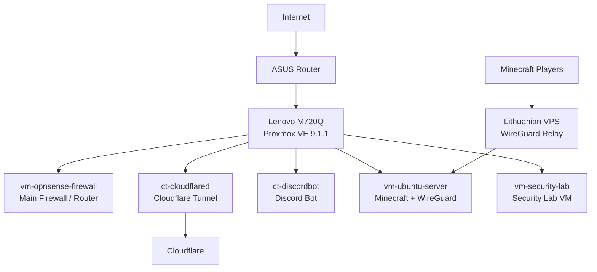

# Network Topology

Sanitized logical topology of the current homelab.

Real IP addresses, domains, tunnel IDs, and credentials are intentionally removed.

## External access

| Method | Purpose |
|---|---|
| Cloudflare Tunnel | Exposes selected public web services without router port forwarding |
| WireGuard to VPS | Relays Minecraft traffic through an external VPS to avoid exposing the residential IP |

## Current public services

| Service type | Exposure method |
|---|---|
| Websites | Cloudflare Tunnel |
| Minecraft server | Lithuanian VPS + WireGuard tunnel |

## Current network notes

- Proxmox is installed bare metal.
- OPNsense runs as a VM and handles real home firewall/router duties.
- The host has one onboard NIC and one USB-C to RJ45 adapter.
- Router port forwarding is currently not used.
- VLAN-aware bridge mode is not enabled yet.
- Network segmentation is planned for future improvement.
